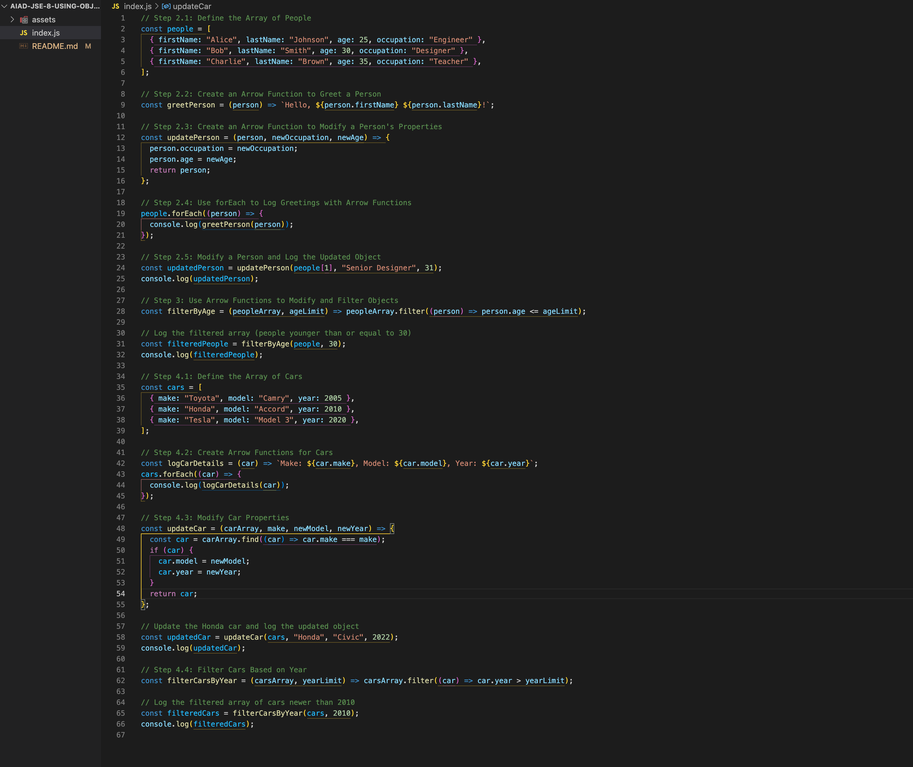

# Using Functions with Objects: Loops, Conditionals, and Object Manipulation


## Description 📄
In this assignment, you will practice writing and using arrow functions to manipulate arrays of objects in JavaScript. Functions are essential in organizing code and reusing logic when handling data structures like arrays and objects. You will work with arrays of people and cars, writing functions to access specific values, modify properties, and use loops and conditionals for dynamic control.

You will start with an array of people objects, each having properties like `firstName`, `lastName`, `age`, and `occupation`. Then, you'll move on to an array of car objects, each with properties like `make`, `model`, and `year`. You will create and use functions that greet people by their names, update their properties, and delete objects based on specific conditions (e.g., removing people or cars based on age or year). The goal is to understand how to build reusable, flexible functions that work with objects and arrays, applying loops and conditionals to solve problems dynamically.

By the end of this assignment, you will:
- Understand how to write arrow functions that take objects as parameters and perform actions on them.
- Use loops and conditionals within functions to iterate over arrays and apply conditions dynamically.
- Modify and return objects using JavaScript array methods like `forEach`, `map`, and `filter`.

---

## Expected Project Structure 🏗️

Your project should be structured as follows:

```plaintext
arrays-of-objects-practice/
   index.js
```

## Instructions ✅

### 1. Create the Project Folder and File

Before starting the coding process, ensure your development environment is prepared.

- [ ] Create a project folder named `arrays-of-objects-practice` to store your project files.
- [ ] Inside the `arrays-of-objects-practice` folder, create a file named `index.js`. This will be your main JavaScript file where all your code will be written.

### 2. Create Arrow Functions to Access and Modify Objects

#### Step 2.1: Define the Array of People

You will begin by defining an array of people objects. Each person object should have properties for `firstName`, `lastName`, `age`, and `occupation`.

- [ ] Add the following code to your `index.js` file:

```javascript
// Array of people
const people = [
    { firstName: 'Alice', lastName: 'Johnson', age: 25, occupation: 'Engineer' },
    { firstName: 'Bob', lastName: 'Smith', age: 30, occupation: 'Designer' },
    { firstName: 'Charlie', lastName: 'Brown', age: 35, occupation: 'Teacher' }
];
```

#### Step 2.2: Create an Arrow Function to Greet a Person

Next, create an arrow function that takes in a person object as an argument and returns a greeting using their first and last names.

- [ ] Add the following code to your `index.js` file:

```javascript
// Arrow function to greet a person by their full name
const greetPerson = person => `Hello, ${person.firstName} ${person.lastName}!`;
```

#### Step 2.3: Create an Arrow Function to Modify a Person's Properties

Now, write an arrow function that takes in a person object, a new occupation, and a new age, then modifies and returns the updated person.

- [ ] Add the following code to your `index.js` file:

```javascript
// Arrow function to modify a person's occupation and age
const updatePerson = (person, newOccupation, newAge) => {
    person.occupation = newOccupation;
    person.age = newAge;
    return person;
};
```

#### Step 2.4: Use `forEach` to Log Greetings with Arrow Functions

Use a `forEach` loop to iterate over the `people` array and log the greeting for each person by calling the `greetPerson` arrow function.

- [ ] Add the following code to your `index.js` file:

```javascript
// Log the greeting for each person using forEach and arrow functions
people.forEach(person => {
    console.log(greetPerson(person));
});
```

#### Step 2.5: Modify a Person and Log the Updated Object with Arrow Functions

Finally, modify Bob's occupation and age by calling the `updatePerson` arrow function, then log the updated object.

- [ ] Add the following code to your `index.js` file:

```javascript
// Modify Bob's occupation and age, then log the updated object
const updatedPerson = updatePerson(people[1], 'Senior Designer', 31);
console.log(updatedPerson);
```

- [ ] Run your code using Node.js in the terminal:

```bash
node index.js
```

### Expected Output:

```bash
Hello, Alice Johnson!
Hello, Bob Smith!
Hello, Charlie Brown!
{ firstName: 'Bob', lastName: 'Smith', age: 31, occupation: 'Senior Designer' }
```

### Explanation:

- **Arrow Function and Object Properties:** This function, `greetPerson`, is written as an arrow function that takes a person object as its parameter and returns a greeting using the `firstName` and `lastName`. Arrow functions provide a more concise syntax and do not have their own `this` context.
- **Modifying Object Properties:** The `updatePerson` arrow function directly modifies the `occupation` and `age` properties of the person object passed to it. Arrow functions do not have their own `this` context, but in this case, it is not needed as we are working directly with the object.

##

## Step 3: Use Arrow Functions to Modify and Filter Objects
Next, you will create an arrow function to remove people over a certain age from the array using loops and conditionals within a filter function.

- [ ] Add the following code to your `index.js` file:

```javascript
// Arrow function to filter people by age
const filterByAge = (peopleArray, ageLimit) => peopleArray.filter(person => person.age <= ageLimit);

// Log the filtered array (people younger than or equal to 30)
const filteredPeople = filterByAge(people, 30);
console.log(filteredPeople);
```

- [ ] Run your code using Node.js in the terminal:

```bash
node index.js
```

### Expected Output:

```bash
[
  { firstName: 'Alice', lastName: 'Johnson', age: 25, occupation: 'Engineer' },
  { firstName: 'Bob', lastName: 'Smith', age: 31, occupation: 'Senior Designer' }
]
```

### Explanation:

- **Filtering with Arrow Functions:** The `filterByAge` arrow function uses the `filter` array method to return a new array of people whose age is less than or equal to the given `ageLimit`. This is an efficient way to dynamically filter out certain elements from an array.

---

## Step 4: Use Arrow Functions for Cars

Now, create an array of car objects and write functions to access, modify, and filter these cars.

### Step 4.1: Define the Array of Cars
- [ ] Start by defining an array of car objects with properties for `make`, `model`, and `year`.

```javascript
// Array of cars
const cars = [
    { make: 'Toyota', model: 'Camry', year: 2005 },
    { make: 'Honda', model: 'Accord', year: 2010 },
    { make: 'Tesla', model: 'Model 3', year: 2020 }
];
```

### Step 4.2: Create Arrow Functions for Cars
- [ ] Create an arrow function to log each car's details.

```javascript
// Arrow function to log car details
const logCarDetails = car => `Make: ${car.make}, Model: ${car.model}, Year: ${car.year}`;

// Log each car's details using forEach
cars.forEach(car => {
    console.log(logCarDetails(car));
});
```

### Expected Output:

```bash
Make: Toyota, Model: Camry, Year: 2005
Make: Honda, Model: Accord, Year: 2010
Make: Tesla, Model: Model 3, Year: 2020
```

### Explanation:

- **Logging Car Details:** The `logCarDetails` arrow function uses template literals to dynamically log each car's details. This makes it easy to format and output the car properties in a readable format.

---

### Step 4.3: Modify Car Properties
- [ ] Write an arrow function to update a car's model and year based on its `make`.

```javascript
// Arrow function to update car properties
const updateCar = (carArray, make, newModel, newYear) => {
    const car = carArray.find(car => car.make === make);
    if (car) {
        car.model = newModel;
        car.year = newYear;
    }
    return car;
};

// Update the Honda car and log the updated object
const updatedCar = updateCar(cars, 'Honda', 'Civic', 2022);
console.log(updatedCar);
```

### Expected Output:

```bash
{ make: 'Honda', model: 'Civic', year: 2022 }
```

### Explanation:

- **Updating Car Properties:** The `updateCar` function finds a car by its `make` and updates its `model` and `year`. This demonstrates how to modify objects dynamically within an array.

---

### Step 4.4: Filter Cars Based on Year
- [ ] Write an arrow function to filter out cars older than a certain year.

```javascript
// Arrow function to filter cars by year
const filterCarsByYear = (carsArray, yearLimit) => carsArray.filter(car => car.year > yearLimit);

// Log the filtered array of cars newer than 2010
const filteredCars = filterCarsByYear(cars, 2010);
console.log(filteredCars);
```

### Expected Output:

```bash
[
  { make: 'Tesla', model: 'Model 3', year: 2020 },
  { make: 'Honda', model: 'Civic', year: 2022 }
]
```

### Explanation:

- **Filtering Cars:** The `filterCarsByYear` function filters out cars that are older than the specified `yearLimit`. This shows how to use the `filter` method to work with arrays of objects.

---

## Step 3: Use Arrow Functions to Modify and Filter Objects
Next, you will create an arrow function to remove people over a certain age from the array using loops and conditionals within a filter function.

- [ ] Add the following code to your `index.js` file:

```javascript
// Arrow function to filter people by age
const filterByAge = (peopleArray, ageLimit) => peopleArray.filter(person => person.age <= ageLimit);

// Log the filtered array (people younger than or equal to 30)
const filteredPeople = filterByAge(people, 30);
console.log(filteredPeople);
```

- [ ] Run your code using Node.js in the terminal:

```bash
node index.js
```

### Expected Output:

```bash
[
  { firstName: 'Alice', lastName: 'Johnson', age: 25, occupation: 'Engineer' },
  { firstName: 'Bob', lastName: 'Smith', age: 31, occupation: 'Senior Designer' }
]
```

### Explanation:

- **Filtering with Arrow Functions:** The `filterByAge` arrow function uses the `filter` array method to return a new array of people whose age is less than or equal to the given `ageLimit`. This is an efficient way to dynamically filter out certain elements from an array.

---

## Step 4: Use Arrow Functions for Cars

Now, create an array of car objects and write functions to access, modify, and filter these cars.

### Step 4.1: Define the Array of Cars
- [ ] Start by defining an array of car objects with properties for `make`, `model`, and `year`.

```javascript
// Array of cars
const cars = [
    { make: 'Toyota', model: 'Camry', year: 2005 },
    { make: 'Honda', model: 'Accord', year: 2010 },
    { make: 'Tesla', model: 'Model 3', year: 2020 }
];
```

### Step 4.2: Create Arrow Functions for Cars
- [ ] Create an arrow function to log each car's details.

```javascript
// Arrow function to log car details
const logCarDetails = car => `Make: ${car.make}, Model: ${car.model}, Year: ${car.year}`;

// Log each car's details using forEach
cars.forEach(car => {
    console.log(logCarDetails(car));
});
```

### Expected Output:

```bash
Make: Toyota, Model: Camry, Year: 2005
Make: Honda, Model: Accord, Year: 2010
Make: Tesla, Model: Model 3, Year: 2020
```

### Explanation:

- **Logging Car Details:** The `logCarDetails` arrow function uses template literals to dynamically log each car's details. This makes it easy to format and output the car properties in a readable format.

---

### Step 4.3: Modify Car Properties
- [ ] Write an arrow function to update a car's model and year based on its `make`.

```javascript
// Arrow function to update car properties
const updateCar = (carArray, make, newModel, newYear) => {
    const car = carArray.find(car => car.make === make);
    if (car) {
        car.model = newModel;
        car.year = newYear;
    }
    return car;
};

// Update the Honda car and log the updated object
const updatedCar = updateCar(cars, 'Honda', 'Civic', 2022);
console.log(updatedCar);
```

### Expected Output:

```bash
{ make: 'Honda', model: 'Civic', year: 2022 }
```

### Explanation:

- **Updating Car Properties:** The `updateCar` function finds a car by its `make` and updates its `model` and `year`. This demonstrates how to modify objects dynamically within an array.

---

### Step 4.4: Filter Cars Based on Year
- [ ] Write an arrow function to filter out cars older than a certain year.

```javascript
// Arrow function to filter cars by year
const filterCarsByYear = (carsArray, yearLimit) => carsArray.filter(car => car.year > yearLimit);

// Log the filtered array of cars newer than 2010
const filteredCars = filterCarsByYear(cars, 2010);
console.log(filteredCars);
```

### Expected Output:

```bash
[
  { make: 'Tesla', model: 'Model 3', year: 2020 },
  { make: 'Honda', model: 'Civic', year: 2022 }
]
```

### Explanation:

- **Filtering Cars:** The `filterCarsByYear` function filters out cars that are older than the specified `yearLimit`. This shows how to use the `filter` method to work with arrays of objects.

---

## Conclusion 📄

In this assignment, you learned how to create and use arrow functions to handle objects and arrays of objects in JavaScript. You applied key concepts like using loops, conditionals, and array methods such as `forEach` and `filter` to access, modify, and delete objects dynamically.

You also explored how to apply logic within arrow functions to make real-time decisions, such as filtering items from arrays based on specific criteria or updating object properties. These skills are essential for working with data structures in JavaScript, particularly when dealing with complex datasets where functions need to be both efficient and reusable.

By mastering these techniques, you have improved your ability to:
- Dynamically manipulate arrays and objects.
- Implement more concise and readable code using arrow functions.
- Utilize `forEach`, `filter`, and other JavaScript methods to traverse and manipulate data collections.
- Apply conditionals and logic within arrow functions to produce tailored outputs or modifications.

As you move forward, keep in mind that these concepts are not just limited to arrays of people or cars. These patterns can be applied to a wide range of data-driven applications, such as handling API responses, processing user data, and building complex web applications.

By practicing these concepts regularly, you will continue to enhance your proficiency in writing efficient, clean, and maintainable JavaScript code.

##

### Solution codebase 👀
🛑 **Only use this as a reference** 🛑

💾 **Not something to copy and paste** 💾

**Note:**  This lab references a solution file located [here](https://github.com/HackerUSA-CE/aiad-jse-8-using-objects-in-functions/tree/solution) (link not shown).